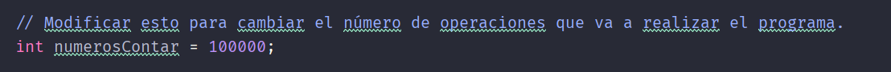
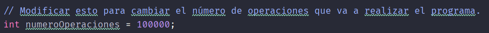

Readme del tema Parallel Streams en Java 8+ (CountDownLatch, CyclicBarrier)

- [Requisitos de ejecución](#requisitos-de-ejecución)
- [Configuración](#configuración)
  - [EfficientParallelStreamExample](#efficientparallelstreamexample)
  - [InefficientParallelStreamExample](#inefficientparallelstreamexample)
  - [BuenUsoParallelStream](#buenusoparallelstream)
  - [MalUsoParallelStream](#malusoparallelstream)

# Requisitos de ejecución

- Para la ejecución de los ejemplos es necesario tener el la versión del Java SDK <b>Java8+</b> o superior.

- Es necesario tener un IDE compatible para la compilación de los ejemplos.

# Configuración

## EfficientParallelStreamExample

Para configurar el ejemplo <i>EfficientParallelStreamExample</i> debes cambia el valor de la variable numerosContar

## InefficientParallelStreamExample

Para configurar el ejemplo <i>InefficientParallelStreamExample</i> debes cambia el valor de la variable numerosContar

## BuenUsoParallelStream

Para configurar el ejemplo <i>BuenUsoParallelStream</i> debes cambia el valor de la variable numeroOperaciones

## MalUsoParallelStream

Para configurar el ejemplo <i>MalUsoParallelStream</i> debes cambia el valor de la variable numeroOperaciones

